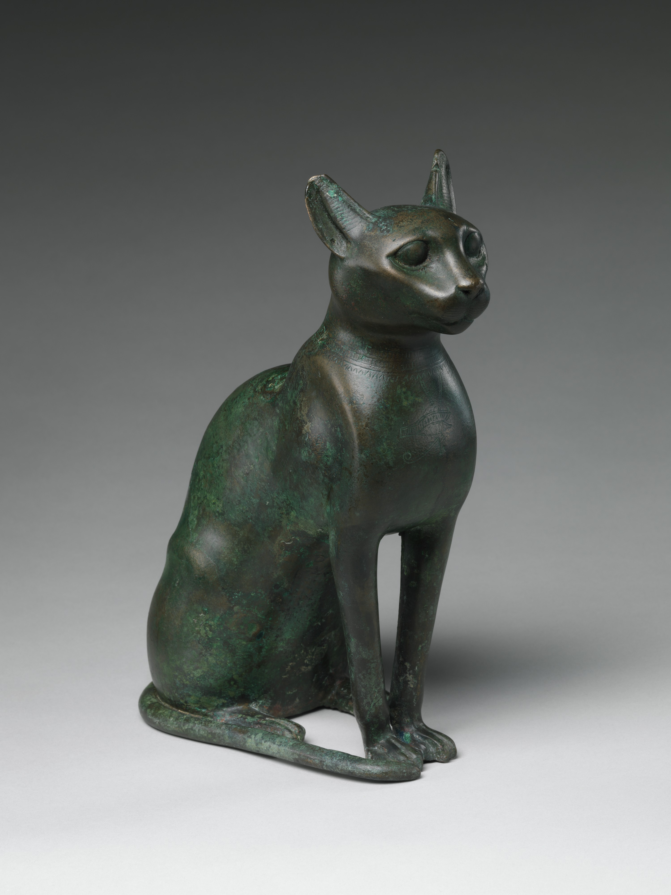

## Welcome to GitHub Pages

This page was generated from [a file on GitHub](https://github.com/LiberalArtist/github-pages-experiments/blob/main/docs/index.md).

### Examples

The source file is written in a plain text format called Markdown.
With Markdown, you can make text **bold** or _italic_ or ***both***.
You can add [links (this one goes to philipmcgrath.com)](https://philipmcgrath.com).
You might want to write a:

- Bulleted
- List
- Like
- This

Or, you could write a:

1. Numbered
2. List
3. Like
4. This

> You might even write
> a blockquote like this.

###  Reference

For more details, see [GitHub Flavored Markdown](https://guides.github.com/features/mastering-markdown/).

### Including an Image

Make sure to write a description for accessibility.

